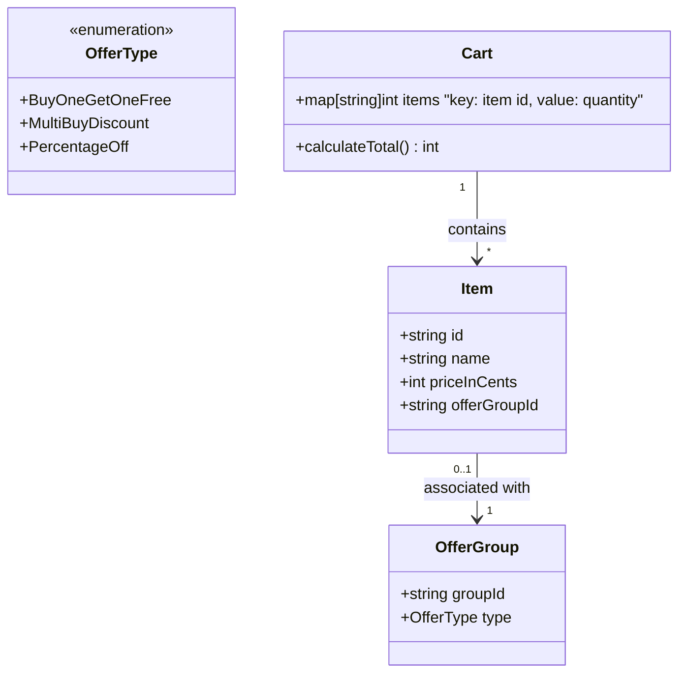
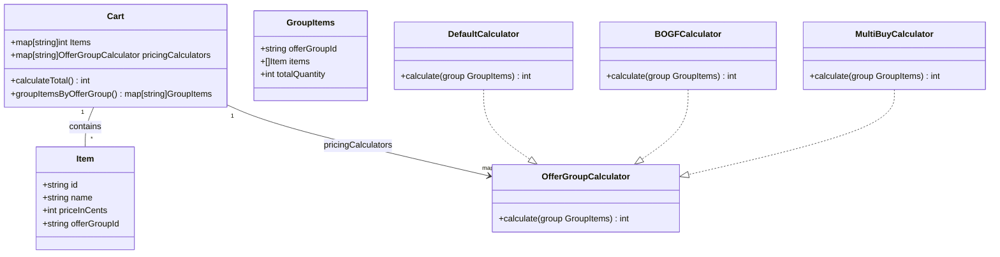
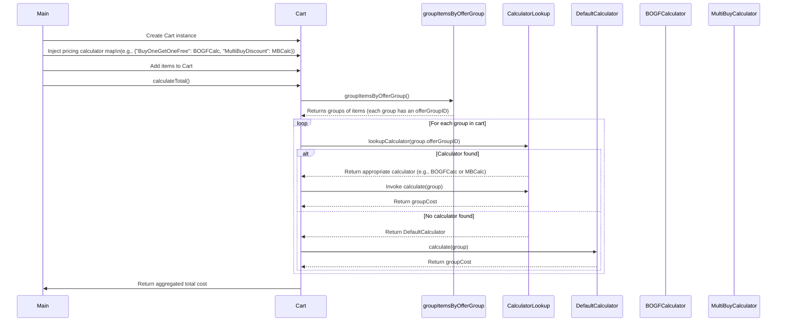

## Initial design

```mermaid
classDiagram
    class Item {
      +string id
      +string name
      +int priceInCents
      +string offerGroupId
    }

    class OfferGroup {
      +string groupId
      +OfferType type
      %% Additional details can be added here
    }

    class OfferType {
      <<enumeration>>
      +BuyOneGetOneFree
      +MultiBuyDiscount
      +PercentageOff
    }

    class Cart {
      +map[string]int items  "key: item id, value: quantity"
      +calculateTotal() int
    }

    Cart "1" --> "*" Item : contains
    Item "0..1" --> "1" OfferGroup : associated with
```

## Proposed design

```mermaid
classDiagram
    class Cart {
      +map[string]int Items
      +map[string]OfferGroupCalculator pricingCalculators
      +calculateTotal() int
      +groupItemsByOfferGroup() map[string]GroupItems
    }

    class Item {
      +string id
      +string name
      +int priceInCents
      +string offerGroupId
    }

    class GroupItems {
      +string offerGroupId
      +[]Item items
      +int totalQuantity
    }

    class OfferGroupCalculator {
      +calculate(group GroupItems) int
    }

    class DefaultCalculator {
      +calculate(group GroupItems) int
    }

    class BOGFCalculator {
      +calculate(group GroupItems) int
    }

    class MultiBuyCalculator {
      +calculate(group GroupItems) int
    }

    Cart "1" -- "*" Item : contains
    Cart "1" --> "map" OfferGroupCalculator : pricingCalculators
    DefaultCalculator ..|> OfferGroupCalculator
    BOGFCalculator ..|> OfferGroupCalculator
    MultiBuyCalculator ..|> OfferGroupCalculator

```

```mermaid
sequenceDiagram
    participant Main as Main
    participant Cart as Cart
    participant Grouping as groupItemsByOfferGroup
    participant Lookup as CalculatorLookup
    participant DefaultCalc as DefaultCalculator
    participant BOGFCalc as BOGFCalculator
    participant MBCalc as MultiBuyCalculator

    Main->>Cart: Create Cart instance
    Main->>Cart: Inject pricing calculator map\n(e.g., {"BuyOneGetOneFree": BOGFCalc, "MultiBuyDiscount": MBCalc})
    Main->>Cart: Add items to Cart
    Main->>Cart: calculateTotal()
    Cart->>Grouping: groupItemsByOfferGroup()
    Grouping-->>Cart: Returns groups of items (each group has an offerGroupID)
    loop For each group in cart
        Cart->>Lookup: lookupCalculator(group.offerGroupID)
        alt Calculator found
            Lookup-->>Cart: Return appropriate calculator (e.g., BOGFCalc or MBCalc)
            Cart->>Lookup: Invoke calculate(group)
            Lookup-->>Cart: Return groupCost
        else No calculator found
            Lookup-->>Cart: Return DefaultCalculator
            Cart->>DefaultCalc: calculate(group)
            DefaultCalc-->>Cart: Return groupCost
        end
    end
    Cart->>Main: Return aggregated total cost

```