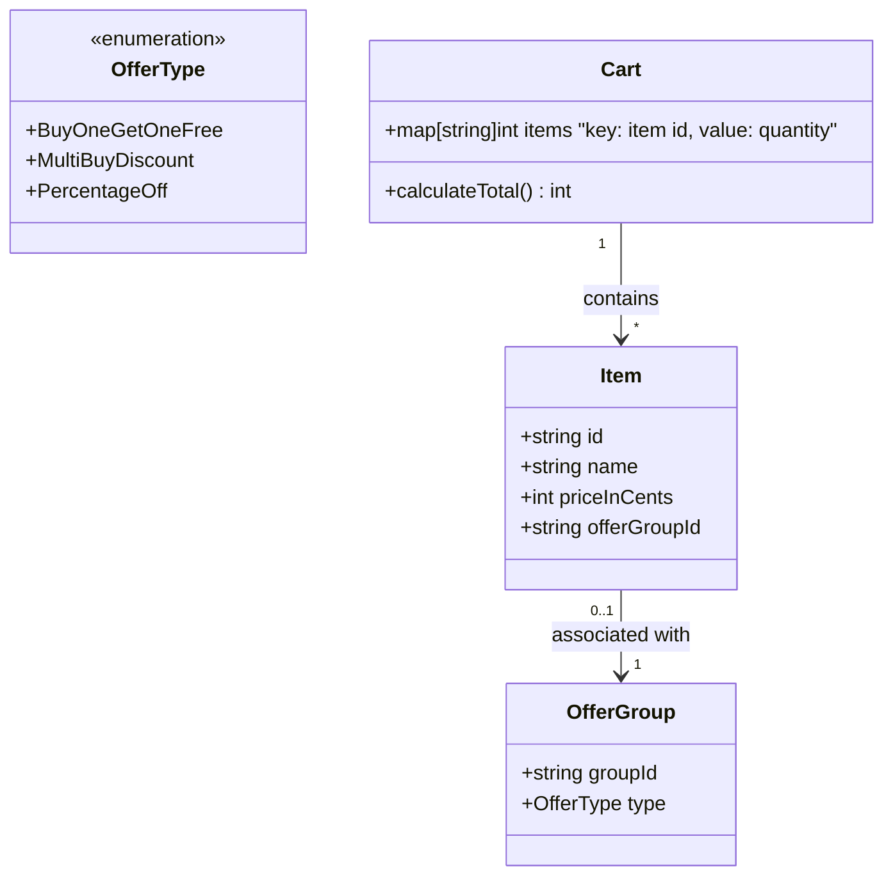

## Initial design

```mermaid
classDiagram
    class Item {
      +string id
      +string name
      +int priceInCents
      +string offerGroupId
    }

    class OfferGroup {
      +string groupId
      +OfferType type
      %% Additional details can be added here
    }

    class OfferType {
      <<enumeration>>
      +BuyOneGetOneFree
      +MultiBuyDiscount
      +PercentageOff
    }

    class Cart {
      +map[string]int items  "key: item id, value: quantity"
      +calculateTotal() int
    }

    Cart "1" --> "*" Item : contains
    Item "0..1" --> "1" OfferGroup : associated with
```