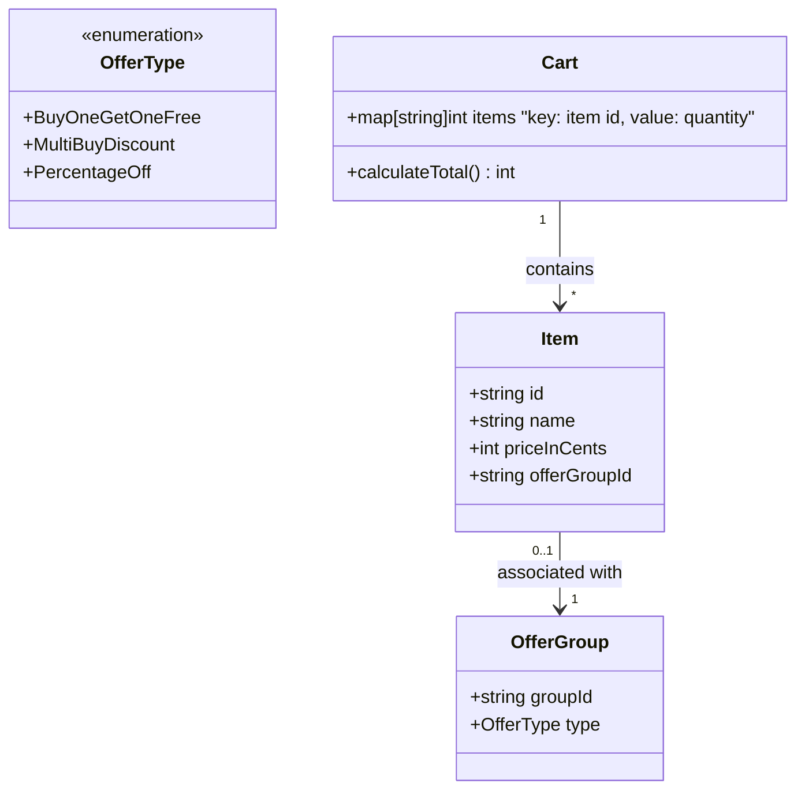
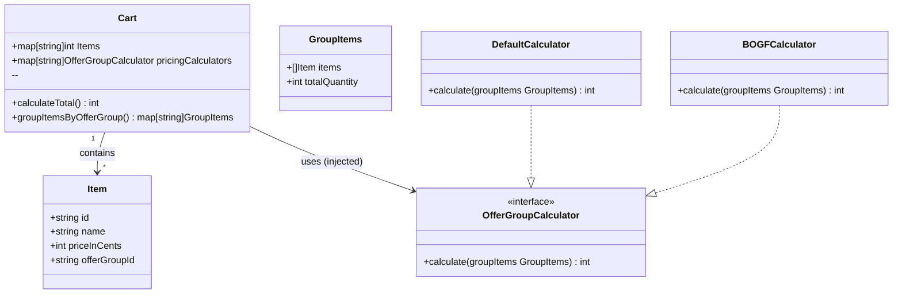
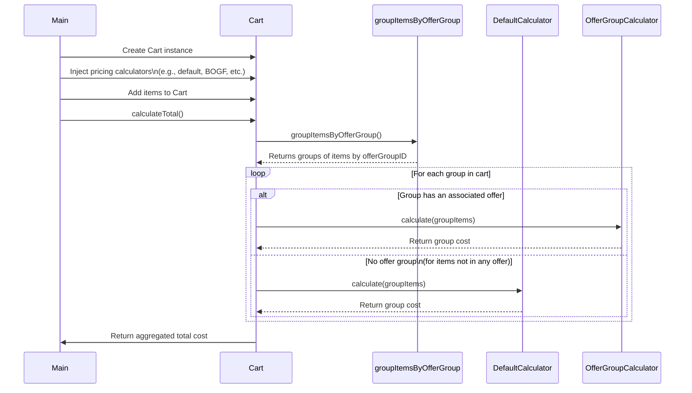

## Initial design

```mermaid
classDiagram
    class Item {
      +string id
      +string name
      +int priceInCents
      +string offerGroupId
    }

    class OfferGroup {
      +string groupId
      +OfferType type
      %% Additional details can be added here
    }

    class OfferType {
      <<enumeration>>
      +BuyOneGetOneFree
      +MultiBuyDiscount
      +PercentageOff
    }

    class Cart {
      +map[string]int items  "key: item id, value: quantity"
      +calculateTotal() int
    }

    Cart "1" --> "*" Item : contains
    Item "0..1" --> "1" OfferGroup : associated with
```

## Proposed design

```mermaid
classDiagram
    class Cart {
      +map[string]int Items
      +map[string]OfferGroupCalculator pricingCalculators
      +calculateTotal() int
      --
      +groupItemsByOfferGroup() map[string]GroupItems
    }

    class Item {
      +string id
      +string name
      +int priceInCents
      +string offerGroupId
    }

    %% Represents a group of items from the cart after grouping.
    class GroupItems {
      +[]Item items
      +int totalQuantity
    }

    class OfferGroupCalculator {
      <<interface>>
      +calculate(groupItems GroupItems) int
    }

    class DefaultCalculator {
      +calculate(groupItems GroupItems) int
    }

    class BOGFCalculator {
      +calculate(groupItems GroupItems) int
    }

    Cart "1" --> "*" Item : contains
    Cart --> OfferGroupCalculator : uses (injected)
    DefaultCalculator ..|> OfferGroupCalculator
    BOGFCalculator ..|> OfferGroupCalculator
```

```mermaid
sequenceDiagram
    participant Main as Main
    participant Cart as Cart
    participant Group as groupItemsByOfferGroup
    participant DefaultCalc as DefaultCalculator
    participant OfferCalc as OfferGroupCalculator

    Main->>Cart: Create Cart instance
    Main->>Cart: Inject pricing calculators\n(e.g., default, BOGF, etc.)
    Main->>Cart: Add items to Cart
    Main->>Cart: calculateTotal()
    Cart->>Group: groupItemsByOfferGroup()
    Group-->>Cart: Returns groups of items by offerGroupID
    loop For each group in cart
        alt Group has an associated offer
            Cart->>OfferCalc: calculate(groupItems)
            OfferCalc-->>Cart: Return group cost
        else No offer group\n(for items not in any offer)
            Cart->>DefaultCalc: calculate(groupItems)
            DefaultCalc-->>Cart: Return group cost
        end
    end
    Cart->>Main: Return aggregated total cost
```